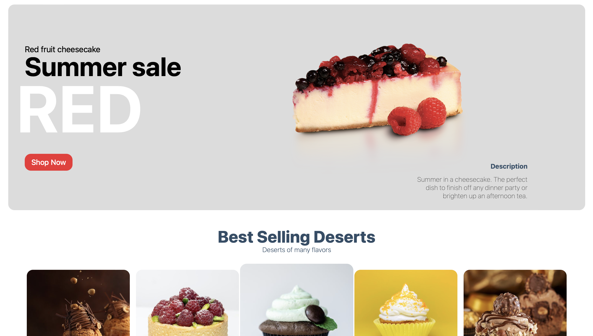

<a name="readme-top"></a>

<!-- PROJECT LOGO -->
<br />
<div align="center">
  <a href="https://github.com/bleckcat/NextJS-Typescript-messager">
    
  </a>

  <h3 align="center">This Project was made to improove my skills with NextJS</h3>

  <p align="center">
    And also proving that I have other capabilities
  </p>
  
</div>

<!-- TABLE OF CONTENTS -->
<details>
  <summary>Table of Contents</summary>
  <ol>
    <li>
      <a href="#about-the-project">About The Project</a>
      <ul>
        <li><a href="#built-with">Built With</a></li>
      </ul>
    </li>
    <li>
      <a href="#getting-started">Getting Started</a>
      <ul>
        <li><a href="#installation">Installation</a></li>
      </ul>
    </li>
    <li><a href="#usage">Usage</a></li>
  </ol>
</details>

<!-- ABOUT THE PROJECT -->

## About The Project

I started this project to show my abilities with NextJS, Strapi, Sanity and ReactJS.

<p align="right">(<a href="#readme-top">back to top</a>)</p>

### Built With

This section should list any major frameworks/libraries/add-ons/plugins used to bootstrap your project.


<p align="right">(<a href="#readme-top">back to top</a>)</p>

<!-- GETTING STARTED -->

## Getting Started

This is an example of how you may give instructions on setting up your project locally.
To get a local copy up and running follow these simple example steps.

<!-- Installation -->

### Installation

1. Clone the repo
   ```sh
   git clone https://github.com/bleckcat/Ecommerce
   ```
2. Install NPM packages
   ```sh
   npm install
    # or
   yarn install
   ```
3. Run the development server:

   ```bash
   npm run dev
   # or
   yarn dev
   ```

   Open [http://localhost:3000](http://localhost:3000) with your browser to see the result.

4. Remember to get all your KEYS from Strapi and Sanity and add them to the .env

   ```bash
   NEXT_PUBLIC_SANITY_TOKEN

   NEXT_PUBLIC_STRIPE_PUBLISHABLE_KEY

   NEXT_PUBLIC_STRIPE_SECRET_KEY
   ```

5. For the the images and back-end you can download the [https://github.com/bleckcat/Ecommerce-sanity](EcommerceSanity) project.

<p align="right">(<a href="#readme-top">back to top</a>)</p>
